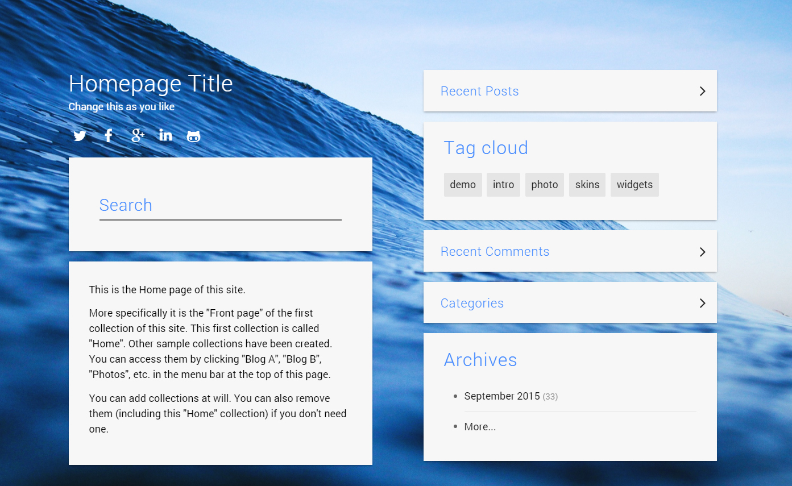
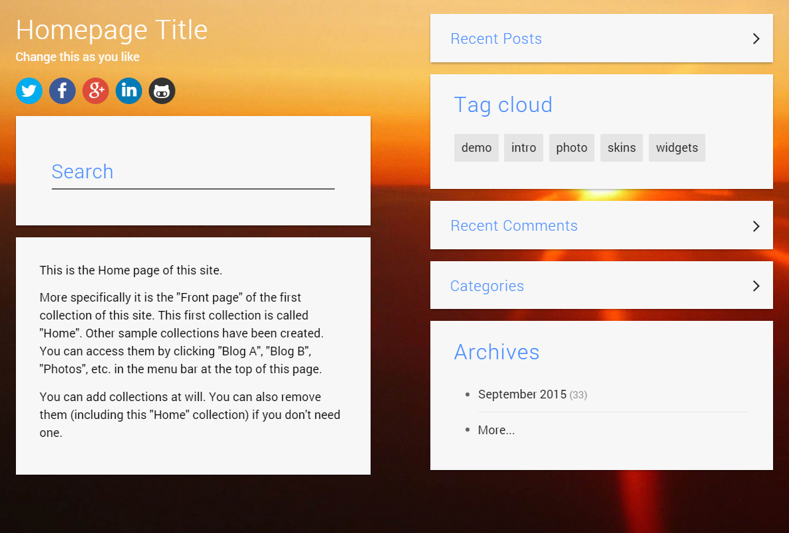
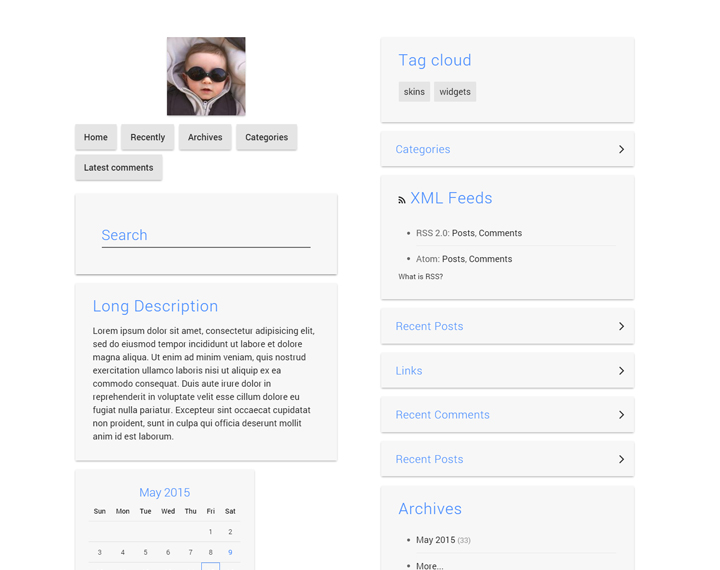

Material is responsive Bootstrap based skin for B2evolution CMS. It is part of the <a href="http://skins.b2evolution.net/material:">Material skin family</a>.
This skin is made especially for <strong>"Home"</strong> collection.

## Main Area Widget Aligns
In the newest version 1.1, you are in complete control of the widgets position. In the Main Area widgets can be placed on the left side (by placing the widgets in the <strong>Front Page Main Area</strong> container) or on the right side (by placing widgets in the<strong> Sidebar 2</strong> container).

## Secondary Area Widget Aligns
In the Secondary Area, widgets are displayed in full container width, but you can decide on the width of each widget by obeying the <a href="https://getbootstrap.com/examples/grid/" title="Bootstrap Grid System Explanation">Bootstrap Grid System</a>.

--- 

### Update Log

#### v1.2.2
- Supported collection kinds function added
- Customization options update
- Translation strings update

#### v1.2.1
- Implemented LESS modules for different widget layouts
- Fixed pagination style issue
- Modified back-office customization translation strings
- Additional small skin fixes

#### v1.2
- Search field script update and search disp layout fixes
- Disp threads layout update

#### v1.1
- login display fixed (including the login form)
- removed hardcoded widgets positioning in the Main Page Area
- Scrolling issue fixed on mainscript.js
- small style fixes